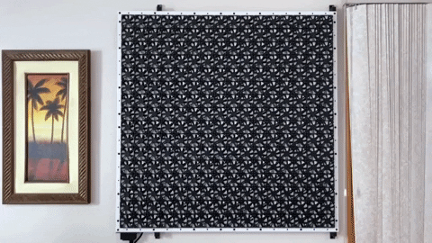
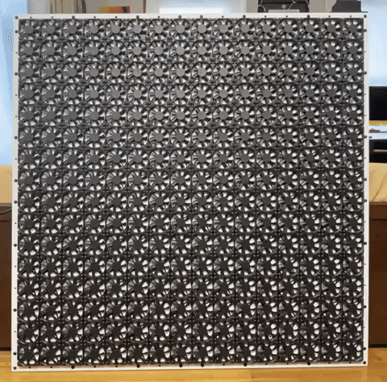

# Fans of Life
Interactive grid of 256 fans that play Conway's Game of Life.

## Description
This art project plays out [Conway's Game of Life](https://en.wikipedia.org/wiki/Conway%27s_Game_of_Life)
on a grid of 256 fans. A spinning fan is "alive" and a stationary fan is "dead".

While Conway's Game of Life is a zero player game, the Fans of Life allows you to edit the current state
by manually spinning or stopping a fan with your finger.

[See a video of the project here.](https://vimeo.com/429323547)

## Hardware/Firmware
The system is setup with 1 controller and 8 cells.

Cells:
* Each cell controls and reads the state of 32 fans.
* Each cell compares the commanded state to the read state to tell if a fan was manually spun or stopped.
* Once a manual input is detected, the cell will correct the commanded state to match the new state.

Controller:
* The controller gets the state of all the fans from the cells and constructs the full grid.
* Using the full grid, the controller calculates the next generation and sends out commands to all cells.
